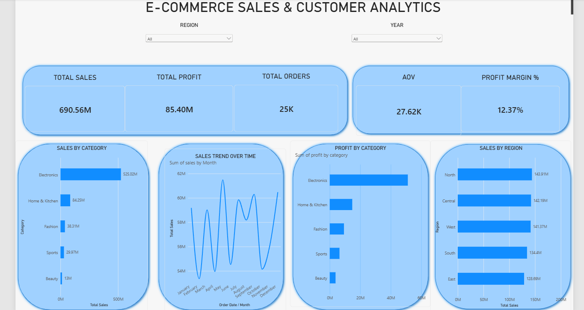
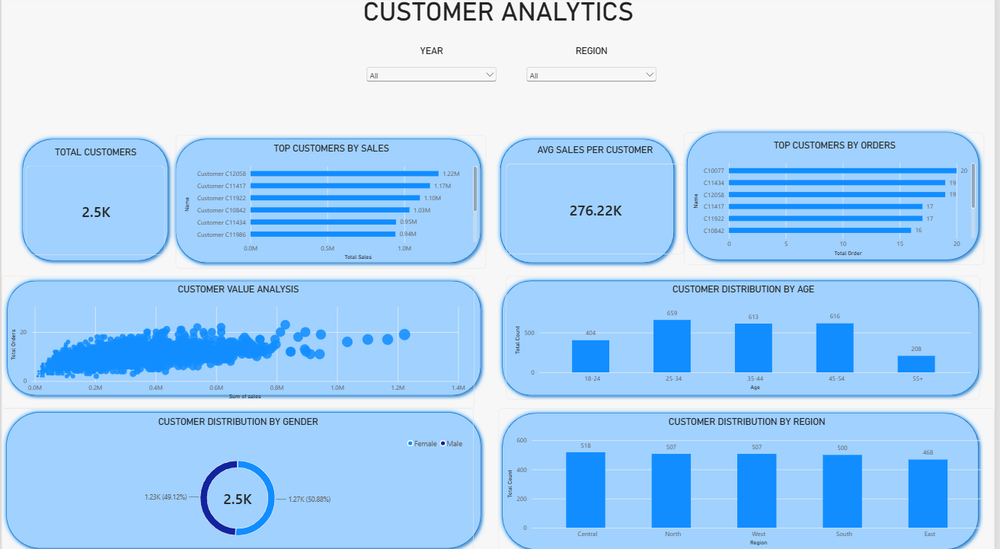
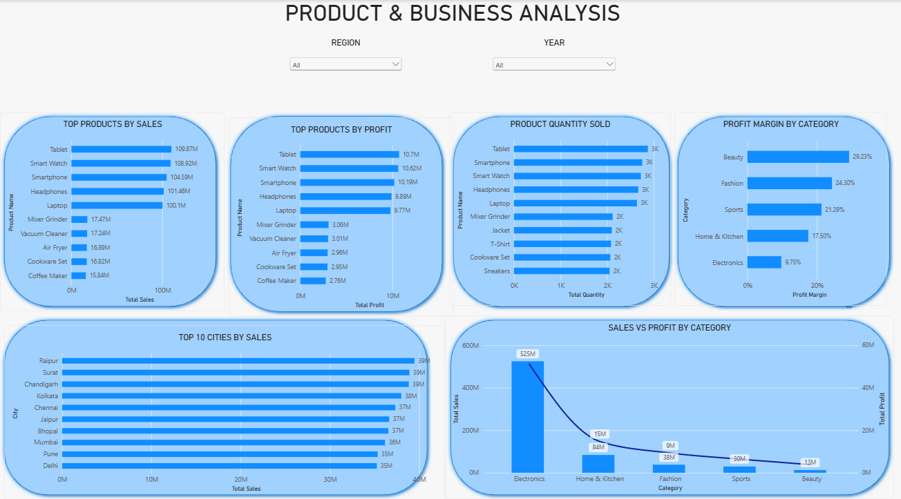

# E-Commerce Sales & Customer Analytics Dashboard

An interactive **3-page Power BI dashboard** designed to analyze e-commerce sales, customer behavior, product performance, profitability, and regional trends.

## 📊 Project Overview

This project transforms raw e-commerce transaction data into meaningful business insights using:

- Excel
- PostgreSQL
- SQL
- Power BI

The dashboard provides an interactive view of sales performance, customer analytics, product performance, and profitability.

## 🎯 Project Objectives

- Analyze overall sales and profit performance
- Identify top-performing products and customers
- Understand customer demographics and behavior
- Analyze regional sales performance
- Compare sales with profit
- Identify high-margin and high-revenue categories
- Build an interactive business intelligence dashboard

## 🛠️ Tools & Technologies

| Tool | Purpose |
|---|---|
| Microsoft Excel | Data cleaning and preparation |
| PostgreSQL | Database storage |
| SQL | Data analysis and querying |
| Power BI | Data visualization and dashboard |
| DAX | Measures and calculations |

## 📑 Dashboard Pages

### 1. Executive Sales

Includes:

- Total Sales
- Total Profit
- Total Orders
- Average Order Value (AOV)
- Profit Margin %
- Sales by Category
- Sales Trend Over Time
- Profit by Category
- Sales by Region

### 2. Customer Analytics

Includes:

- Total Customers
- Top Customers by Sales
- Top Customers by Orders
- Average Sales per Customer
- Customer Value Analysis
- Customer Distribution by Age
- Customer Distribution by Gender
- Customer Distribution by Region

### 3. Product & Business Analysis

Includes:

- Top Products by Sales
- Top Products by Profit
- Product Quantity Sold
- Profit Margin by Category
- Top 10 Cities by Sales
- Sales vs Profit by Category

## 📈 Key Insights

- Total sales reached approximately **690.56M** across **25K orders**.
- Total profit was approximately **85.40M**, with an overall profit margin of **12.37%**.
- Electronics generated the highest total sales and total profit.
- Beauty had the highest profit margin at approximately **29.23%**.
- The dashboard contains approximately **2.5K customers**.
- The **25–34** age group represents the largest customer segment.
- Tablet, Smart Watch, Smartphone, Headphones, and Laptop were among the leading products by sales.

## 🔄 Project Workflow

```text
Raw E-Commerce Data
        ↓
Excel Data Cleaning
        ↓
PostgreSQL Database
        ↓
SQL Analysis
        ↓
Power BI Data Modeling
        ↓
DAX Measures
        ↓
Interactive Dashboard
        ↓
Business Insights

```
## 📊 Dashboard Preview

### 1. Executive Sales



### 2. Customer Analytics



### 3. Product & Business Analysis



